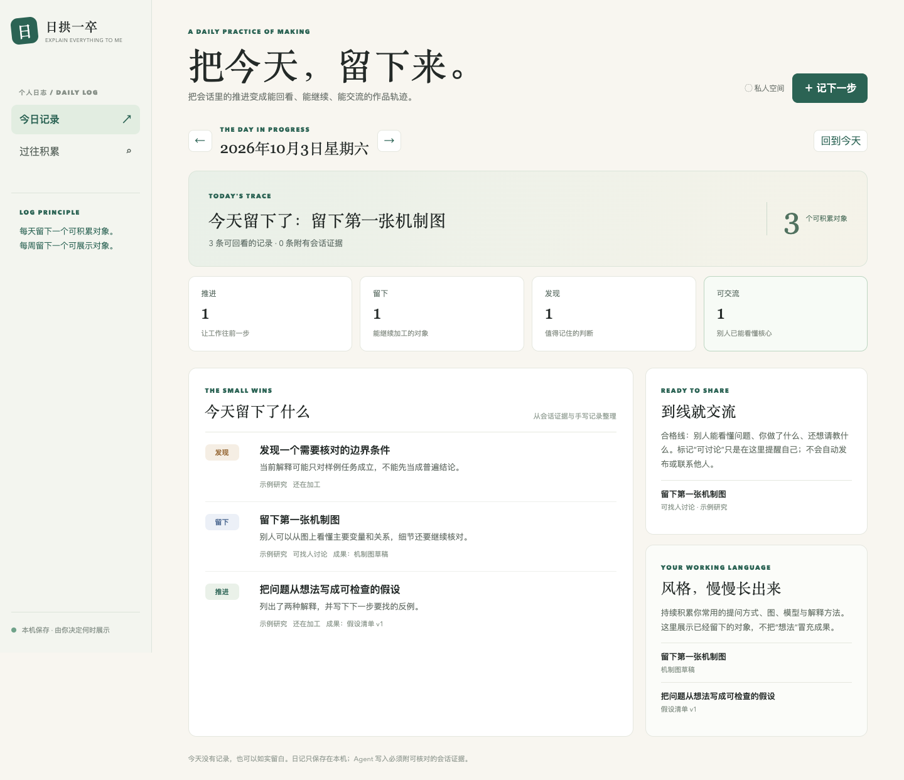

# 日拱一卒：每日日志原型

## 目的

把一天的 Agent 对话和用户手写记录，整理成能继续加工的轨迹。首页按日期展示四件事：推进了什么、留下了什么对象、发现了什么、哪些对象已可交流。项目名称只用于归类；“可交流”是用户判断的状态，不触发发布、通知或联系他人。

## 设计规则

- 一条日志写一件可核对的变化。能指出产物时，填文件名或链接；只有讨论、没有行动时，写为“发现”，不冒充成果。
- Agent 从已打开的会话原文抽取事实，不从搜索摘要直接生成日志。自动写入条目必须带至少一个 WorkRef，说明它来自哪里。
- 同一天的同一事项使用稳定 `key` 更新（键含本地日期、工作区和事项），不因多次调用产生重复条目。用户手动改过的字段保留；用户删掉的自动条目不会再次出现。
- Agent 最多建议“可找人讨论”，不能标记“已经交流”。展示给谁、展示什么、何时发送，由用户决定。
- 日期按用户本地时区归属。跨午夜的会话按每项进展实际发生的时间归日，不能把整段长会话都算到最后一天。
- 原始会话仍保存在 sivtr；日志仅保存简短结论、产物位置和 WorkRef。避免复制密钥或长篇会话。

## 当前原型




```bash
python3 components/daily-journal/journal.py serve
```

页面位于 `http://127.0.0.1:8767/`。数据默认保存在 `~/.explain-everything-to-me/daily-journal/data.json`。可手动新增、编辑、删除条目，也可按日期查看。空日志不会自动填示例数据。单独展示虚构数据时：

```bash
python3 components/daily-journal/journal.py --data /tmp/journal-demo.json seed --input components/daily-journal/example.json
python3 components/daily-journal/journal.py --data /tmp/journal-demo.json serve --port 8767
```

Agent 的导入接口已实现，但**还没有接入 `explain-everything-to-me` 的调用钩子，也没有每日定时任务**。目前不会自动扫描所有 Agent 会话。未来接入时，应在用户显式调用本 Skill 并要求记日志，或用户另设每日自动任务时，先按当日时间窗检索多宿主记录、阅读原文，再把本次核对的变化交给导入接口。不能因为页面打开就扫描会话。

## 导入格式

把 JSON 写到本机文件，或通过标准输入传入：

```bash
python3 components/daily-journal/journal.py import --input /path/to/events.json
```

```json
{
  "events": [{
    "key": "2026-10-03:/absolute/workspace:stable-topic-key",
    "date": "2026-10-03",
    "kind": "artifact",
    "title": "留下第一版结构图",
    "detail": "图上已经能说明三个变量的关系；仍需核对边界条件。",
    "project": "示例项目",
    "artifact": "figure-draft.svg",
    "readiness": "discussable",
    "workrefs": ["codex/example/1"]
  }]
}
```

`kind` 可取 `progress | artifact | insight | share`；`readiness` 可取 `private | discussable`。`shared` 仅由用户在页面标记。`key` 应由本地日期、真实工作区和事项构成，不含随机时间戳。导入重复键时更新 Agent 字段，并保留用户修改。数据文件权限为 `0600`。

## 待接入 Skill 时

1. 把此目录补上 `component.json`，再由安装器作为可选组件列出；用户选中后才安装。
2. 在 `SKILL.md` 增加一条有条件的调用路由，指向独立参考文件。明确按本地日期检索和核对、去重、失败回报。
3. 增加首次采集边界、跨会话去重和用户允许自动记录的设置。把手写日记与 Agent 摘录分开标注。
4. 如果用户要每日自动运行，用宿主的定时任务能力单独创建；当前原型不隐式启动后台扫描。
